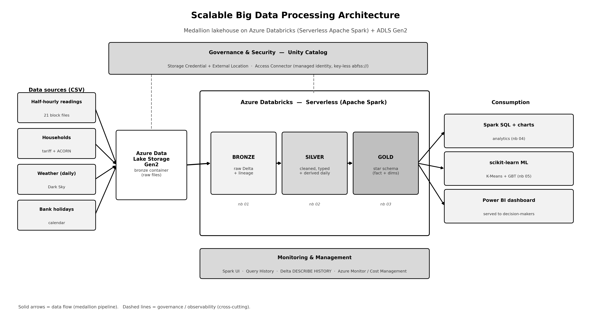
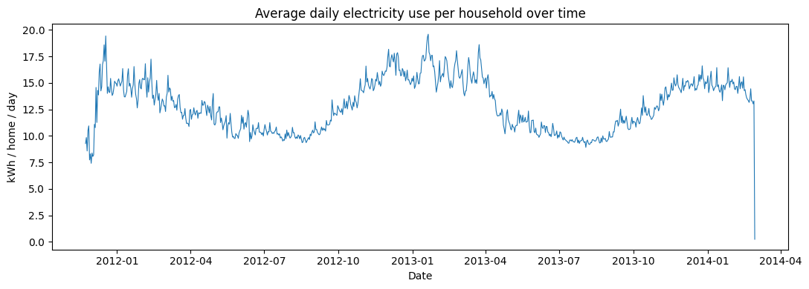
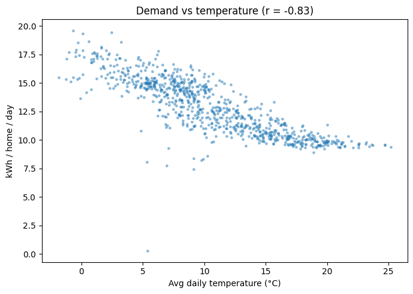
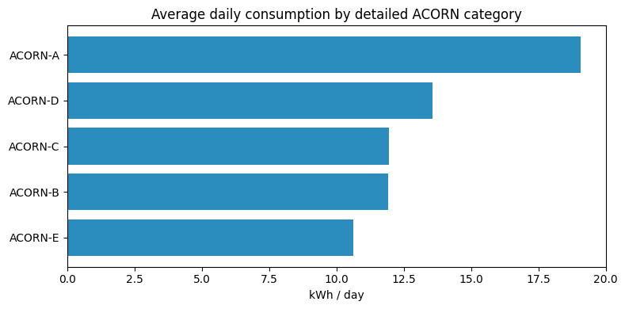
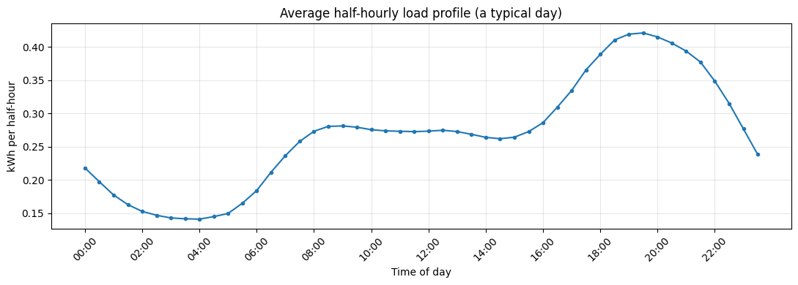
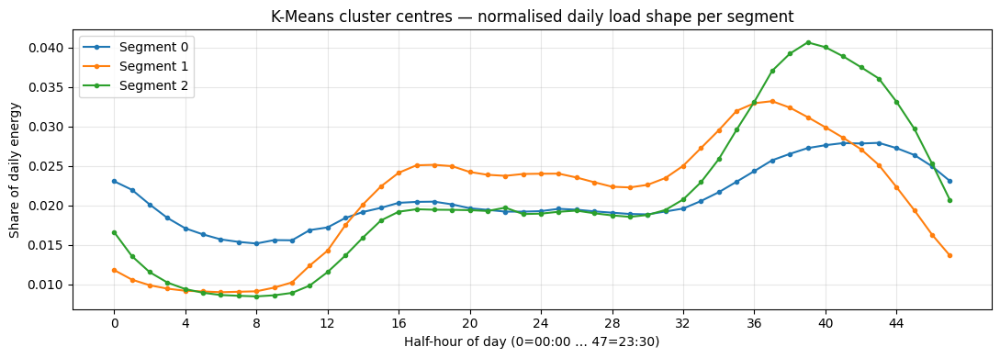
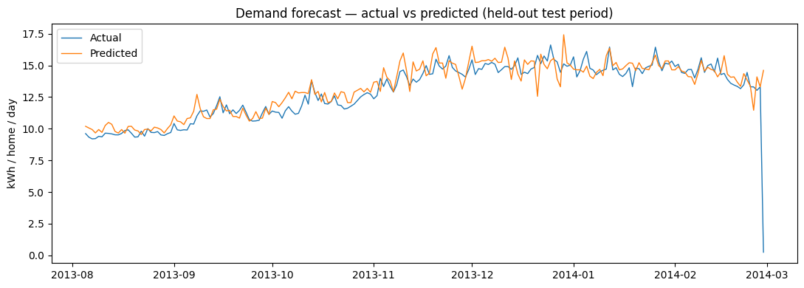
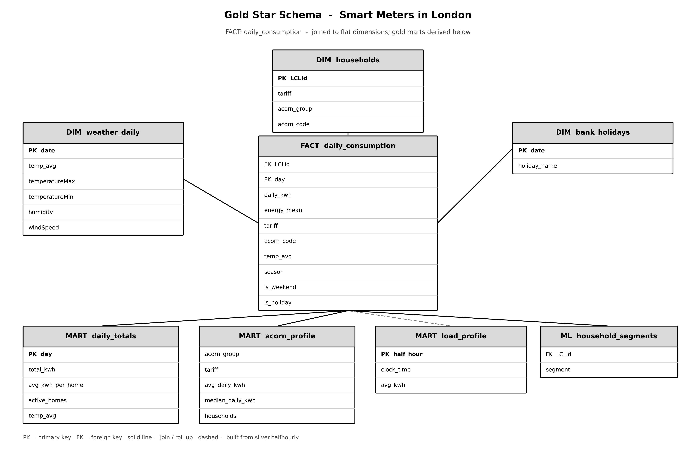
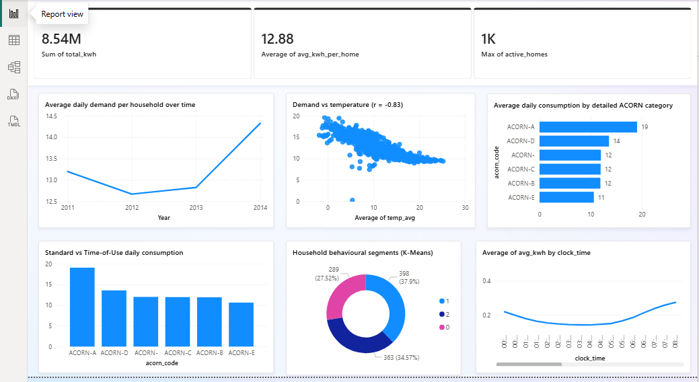

# Optimizing Big Data Processing in the Cloud — Smart Meters in London

A cloud-based **big data lakehouse** built on **Azure Databricks (Serverless Apache Spark)** and
**Azure Data Lake Storage Gen2**, implementing a **medallion (bronze → silver → gold)** architecture
over the *Smart Meters in London* dataset. The pipeline ingests **over 31.7 million half-hourly
electricity readings**, cleans and conforms them, derives analytics-ready tables, produces
descriptive insights, trains two machine-learning models, and serves the results to an interactive
dashboard.

> Coding artefact for **BDCC LDS7005 — Big Data and Cloud Computing (Component 1)**, York St John University.
> The full written report accompanies this repository as a separate submission.

---

## Architecture



Four CSV sources land in ADLS Gen2 and are progressively refined through three Delta table layers on
Databricks Serverless, then consumed by Spark SQL analytics, scikit-learn models and a Power BI
dashboard. **Unity Catalog** provides key-less, governed access (managed identity, no account keys),
and a monitoring layer (Spark UI, Query History, Delta `DESCRIBE HISTORY`) observes the running system.

| Layer | Purpose |
|---|---|
| **Bronze** | Faithful, replayable raw copy of each source with lineage columns (`_source_file`, `_ingested_at`). |
| **Silver** | Cleaned, typed, de-duplicated tables; the daily table is **derived** from the half-hourly readings. |
| **Gold** | Business-ready star schema — a `daily_consumption` fact plus dimensions and pre-aggregated marts. |

---

## Repository structure

```
.
├── notebooks/                 # PySpark / Spark SQL pipeline (Databricks-importable .ipynb)
│   ├── 00_config_and_setup.ipynb
│   ├── 01_bronze_ingestion.ipynb
│   ├── 02_silver_cleaning.ipynb
│   ├── 03_gold_aggregation.ipynb
│   ├── 04_analysis_and_insights.ipynb
│   └── 05_ml_segmentation_forecast.ipynb
├── sql/
│   ├── schema.sql             # full DDL / data dictionary for every bronze/silver/gold table
│   └── 06_dashboard.sql       # dashboard tile queries (Databricks SQL / Power BI)
├── docs/
│   ├── SETUP_blob_access.md   # one-time Unity Catalog External Location setup
│   ├── DASHBOARD_GUIDE.md     # build a Databricks AI/BI or Power BI dashboard
│   └── SCHEMA_DIAGRAM.md      # star-schema / ER description
├── figures/                   # architecture, schema and result charts
└── tools/                     # helper scripts (report + diagram generators)
```

---

## Dataset

**Smart Meters in London** (Low Carbon London project, UK Power Networks) — publicly available on Kaggle:
<https://www.kaggle.com/datasets/jeanmidev/smart-meters-in-london> (~11 GB uncompressed).

The pipeline is driven by the **raw half-hourly readings** (`LCLid, tstp, energy(kWh/hh)`), split into
21 block files for parallel ingestion. Daily aggregates and the load profile are **derived** in the
silver/gold layers, so no separate pre-aggregated files are needed. Supporting dimensions: household
information (tariff + ACORN), daily weather (Dark Sky) and UK bank holidays.

> The raw data is **not committed** to this repository (size + licensing). Download it from Kaggle and
> upload it to your own ADLS Gen2 container (or a Databricks Volume) as described below.

---

## How to run

1. **Import the notebooks** into a Databricks workspace (Workspace → Import) and keep them in one
   folder (each calls `%run ./00_config_and_setup`).
2. **Give Serverless access to your data** — follow [`docs/SETUP_blob_access.md`](docs/SETUP_blob_access.md)
   to create the Unity Catalog Storage Credential + External Location over
   `abfss://<container>@<account>.dfs.core.windows.net/`. (A Databricks Volume fallback is included.)
3. **Configure & run in order.** Open `00`, attach **Serverless**, set the widgets
   (`source_mode`, `catalog`, `storage_account`, `container`), **Run All**, then run `01 → 02 → 03 → 04 → 05`.
4. **Build the dashboard** (optional) — see [`docs/DASHBOARD_GUIDE.md`](docs/DASHBOARD_GUIDE.md).

---

## Results & insights

| Question | Finding |
|---|---|
| Demand over time | Strong seasonal cycle — high in winter, low in summer. |
| Affluence vs demand | ACORN-A households use **~80% more** than ACORN-E. |
| Tariff effect | Time-of-Use homes average **11.90** vs **13.15 kWh/day** for Standard (≈10% lower). |
| Weather sensitivity | Demand vs temperature **Pearson r = −0.83** (heating-led). |
| Seasonality | Winter **15.08** vs summer **10.08 kWh/home/day**. |
| Daily shape | Pronounced evening peak around **17:00–20:00**. |

| Demand trend | Demand vs temperature |
|---|---|
|  |  |

| ACORN affluence gradient | Daily load profile |
|---|---|
|  |  |

### Machine learning

Spark MLlib is not whitelisted on Serverless, so the models use **scikit-learn** on Spark-aggregated
data (Spark for distributed ETL, single-node for ML).

- **Customer segmentation (K-Means)** on L1-normalised 48-point daily load shapes → **3 behavioural
  segments** (289 / 398 / 363 households).
- **Demand forecast (Gradient-Boosted Trees)** from weather + calendar features, time-based hold-out:

| Metric | Value |
|---|---|
| RMSE | 1.25 kWh |
| MAE | 0.66 kWh |
| R² | 0.68 |

Temperature dominates feature importance (**0.86**), corroborating the r = −0.83 correlation.

| K-Means segments | GBT forecast |
|---|---|
|  |  |

---

## Data model

The gold layer is a star schema: a central `daily_consumption` fact joined to flat dimensions
(`households`, `weather_daily`, `bank_holidays`), with derived marts (`daily_totals`, `acorn_profile`,
`load_profile`) and an ML output table (`household_segments`). Full column-level DDL is in
[`sql/schema.sql`](sql/schema.sql).



---

## Dashboard

The gold tables are served to an interactive dashboard (Power BI via the native Azure Databricks
connector, and/or a native Databricks AI/BI dashboard) — see [`docs/DASHBOARD_GUIDE.md`](docs/DASHBOARD_GUIDE.md).



---

## Tech stack

Azure Databricks (Serverless Apache Spark) · Azure Data Lake Storage Gen2 · Delta Lake · Unity Catalog ·
PySpark / Spark SQL · scikit-learn · matplotlib · Power BI.

---

## Mapping to the assessment brief

| Brief section | Where |
|---|---|
| 1. Data Ingestion & Storage | `00`, `01`, `docs/SETUP_blob_access.md` |
| 2. Scalable Processing Architecture | medallion design, Serverless Spark (`figures/architecture_diagram.png`) |
| 3. Data Extraction & Pre-processing | `01` (parallel ingest, lineage), `02` (clean, cast, dedupe, derive) |
| 4. Data Analysis & Insights | `04` (SQL + charts), `05` (K-Means + GBT), dashboard |
| 5. Cost Optimisation | Serverless pay-per-use, Delta/Parquet compression, auto-stop |
| 6. Security & Compliance | Unity Catalog governance, managed-identity access, UK GDPR |
| 7. Performance Monitoring | Spark UI, Query History, Delta `DESCRIBE HISTORY` |

---

## License

Released under the MIT License — see [`LICENSE`](LICENSE). Dataset © UK Power Networks / Low Carbon
London, used under its original terms (see the Kaggle page).
